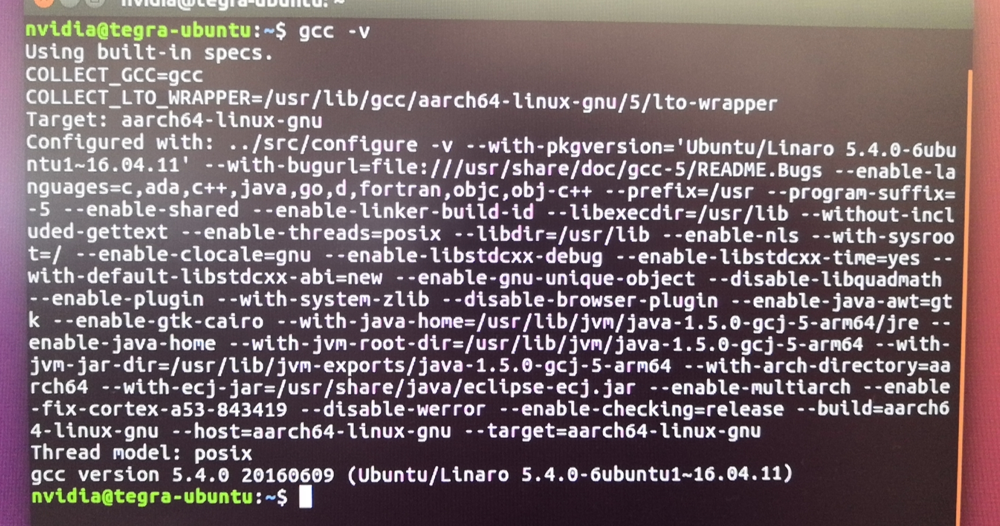
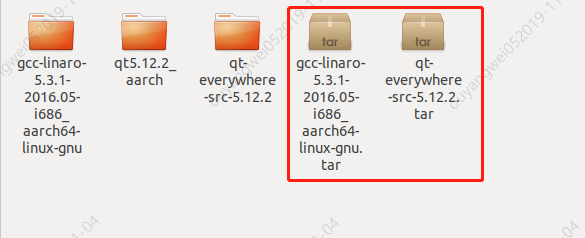
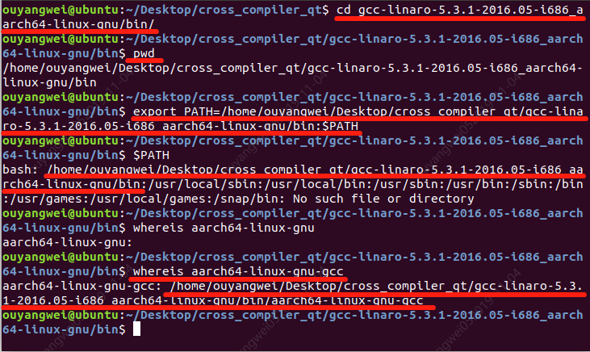

# 交叉编译Qt源码指南

## 1、前置工作

**交叉编译前，需要先搭建交叉编译的环境，即：① “目标设备” 编译环境（例如：aarch64-linux-gnu，）。②待编译的Qt源码。**

<p style="color:red;font-style:italic">” aarch64-linux-gnu不知道怎么办 ？“</p>
<p style="color:blue;font-style:italic">先查看您的 “目标设备” 的编译器版本，如：</p>

```shell
gcc -v
```

  

<p style="color:blue;font-style:italic">注意到 Target: aarch64-linux-gnu，因此得知目标设备的编译环境。</p>

## 2、下载【前置工作】中的编译环境。

 **给出本指南中示范的aarch64-linux-gnu的下载地址：[aarch64-linux-gnu]( http://releases.linaro.org/components/toolchain/binaries/ )**

<p style="color:red;font-style:italic">注意：这是一个父链接，目的是让大家找到合适自己的版本，遵循兼容性的一般要求，选择比以目标设备的低且最接近的版本为最优。</p>

**Qt的源码版本，自行选择所需的即可。**  

**下载并解压后，则环境已准备好，如下图：**



## 3、配置 ”环境变量“

**需要将目标设备的编译器路径配置到“环境变量”中，即whereis xxx 能成功找到，如图：**



<p style="color:red;font-style:italic">whereis能找到，说明“环境变量”已配置成功。中间有一行whereis失误，请弹幕喷子饶命！</p>

## 4、办正事（配置编译参数、解决中间遇到的一些问题记录）

### ./configure配置

**切换到Qt源码下，执行./configure**

```shell
./configure -prefix /home/ouyangwei/Desktop/cross_compiler_qt/qt5.12.2_aarch -xplatform linux-aarch64-gnu-g++ -no-opengl
```

<p style="color:red;font-style:italic">仅解释-prefix、-xplatform和-no-opengl参数。<br>-prefix参数：表示的是在make成功之后，执行make install时，会将编译成功的必要文件复制到该文件夹下。（包括：可执行文件、库文件、头文件等）。<br>-xpaltform参数：表示您的编译平台，如果您不了解，请您进入到Qt源码下qt-everywhere-src-5.12.2/qtbase/mkspecs这个文件夹即一目了然，即：每一个子文件夹对应一个平台，linux-aarch64-gnu-g++则表示使用linux-aarch64-gnu-g++文件夹下的编译选项。<br>-no-opengl参数：表示您在编译的时候不需要参与编译的模块，使用no-xxx的形式达到不需要某个模块的效果，嵌入式一般不需要/不支持编译opengl；一般地，实际的编译行为应当是，哪个模块导致编译不通过时才应当跳过该模块。</p>

### 编译

```shell
make
或
make -j8 // 8线程编译，可根据实际情况配置合适的线程数

make install // 安装，即安装到-prefix参数配置的路径下
```

### 问题记录

<p style="color:red;font-style:italic">① ERROR: Cannot compile a minimal program. The toolchain or QMakeSpec is broke...</p>
根据错误提醒，查看config.log文件，查得错误主要定位在这里：error while loading shared libraries: libz.so.1: cannot open shared object file:...

定位到这里问题就很简单了，缺少 libz.so.1 这个库。安装一下就可以了。

```shell
sudo apt-get install lib32z1
```

<p style="color:red;font-style:italic">② 其他问题待跟进...</p>